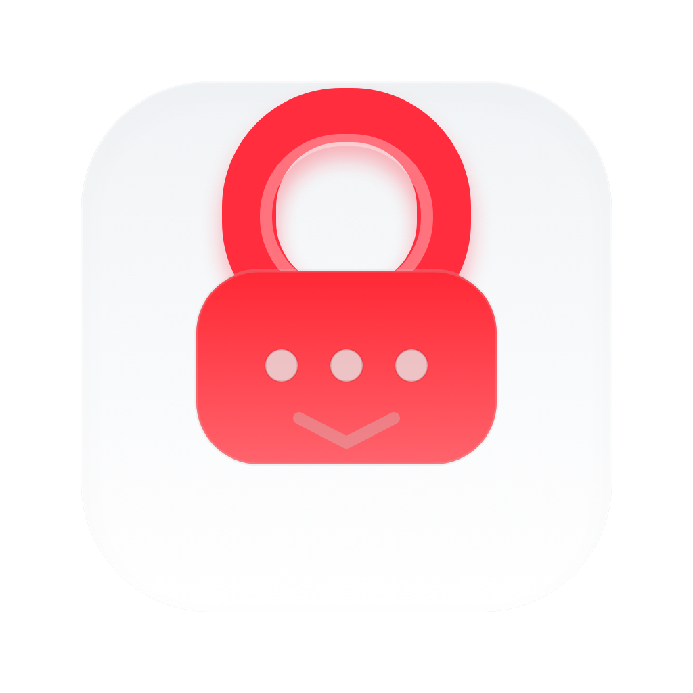
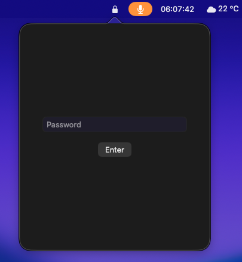
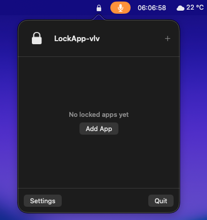
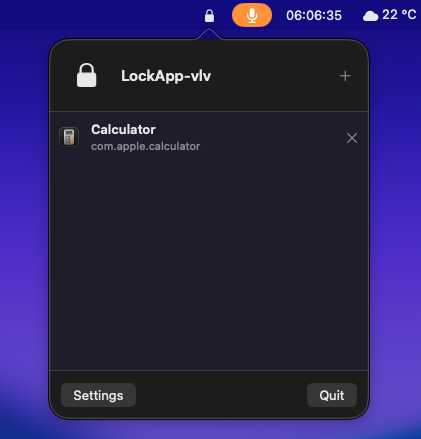
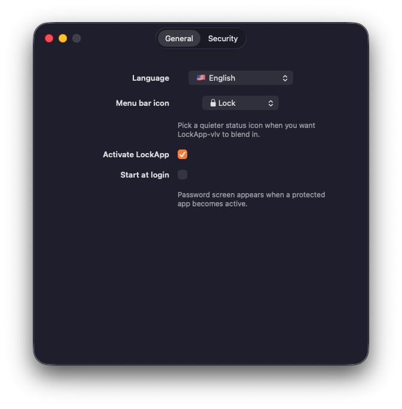
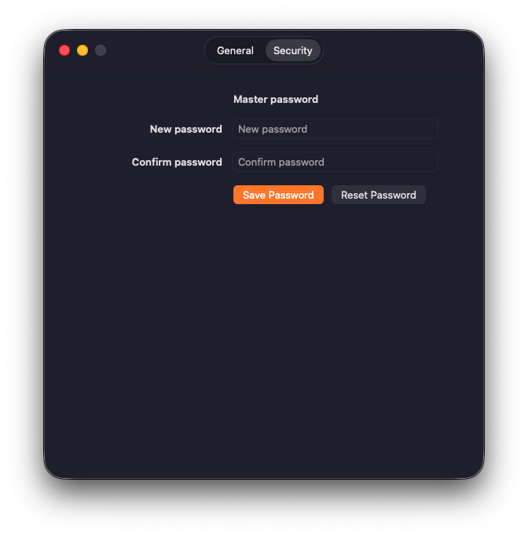
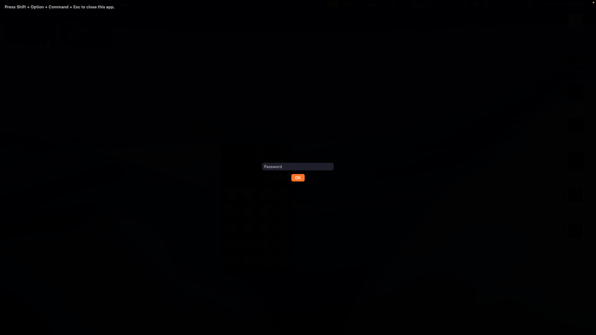

# LockApp-vlv

<p align="center">
  
</p>

<p align="center">
  <strong>A tiny, native macOS app locker that puts selected apps behind a password screen.</strong><br>
  Protect focus, privacy, and quick personal access on your own Mac. Free, local, and MIT licensed.
</p>

<p align="center">
  <a href="https://github.com/VlV-515/lockapp-vlv">View source</a> ·
  <a href="https://github.com/VlV-515/lockapp-vlv/releases/tag/v1.1.0">Download v1.1.0</a> ·
  <a href="#install">Install</a> ·
  <a href="#how-it-works">How it works</a> ·
  <a href="#what-it-does-not-do">Limits</a>
</p>

<p align="center">
  
  
  
  
  
  
</p>

## Why LockApp-vlv?

LockApp-vlv is for the moments when you want a little friction before opening specific macOS apps: finance tools, chats, admin utilities, private notes in another app, or anything you do not want exposed the second someone clicks around your Mac.

It lives in the menu bar, keeps its settings on your machine, and shows a clean full-screen password overlay whenever a protected app becomes active.

No account. No subscription. No cloud sync. No heavyweight security theater. Just a focused native macOS utility that is nice to use and easy to inspect.

## Screenshots

<p align="center">
  
  
  
</p>

<p align="center">
  
  
</p>

<p align="center">
  
</p>

## Features

- Native macOS menu bar app built with Swift, AppKit, and SwiftUI.
- Password-gated menu panel, so the protected app list is hidden until unlocked.
- Add installed `.app` bundles to a protected app list.
- Remove protected apps from the menu panel.
- Full-screen password overlay when a protected app becomes active.
- Overlay does not show the protected app name.
- One master password for the menu panel and the lock overlay.
- Default master password: `vlv`.
- Change or reset the master password from Settings.
- Master password is stored in macOS Keychain.
- Protected app metadata and preferences stay in local macOS preferences.
- Optional launch at login.
- Global enable/disable toggle for LockApp-vlv.
- Selectable menu bar icon: lock, document, folder, calendar, grid, or gear.
- English UI by default.
- Spanish (Mexico) UI available from Settings.
- Shortcut to close the currently protected app: `Shift + Option + Command + Esc`.
- Custom packaged app icon.
- MIT licensed and free to use.

## Install

### Option 1: Download the public ZIP

1. Go to [GitHub Release v1.1.0](https://github.com/VlV-515/lockapp-vlv/releases/tag/v1.1.0).
2. Download `LockApp-vlv-1.1.0-macos-unsigned.zip` and `LockApp-vlv-1.1.0-macos-unsigned.zip.sha256`.
3. Verify the checksum from the download folder:

```bash
shasum -a 256 -c LockApp-vlv-1.1.0-macos-unsigned.zip.sha256
```

4. Unzip the archive and move `Lockapp-vlv.app` to your `Applications` folder.
5. Open it from Finder. If macOS Gatekeeper blocks the first launch, right-click the app and choose **Open**.
6. Click the menu bar icon, enter the default password `vlv`, and set your own password in **Settings > Security**.

This release is ad-hoc signed only. It is not signed with an Apple Developer ID certificate and it is not notarized by Apple. macOS Gatekeeper may warn that the app cannot be verified.

SourceForge is a secondary mirror for the same ZIP and checksum: [LockApp-vlv on SourceForge](https://sourceforge.net/projects/lockapp-vlv/files/).

### Option 2: Build from source

Requirements:

- macOS 13 Ventura or newer.
- Swift 5.9 or newer.
- Xcode Command Line Tools.

```bash
git clone https://github.com/VlV-515/lockapp-vlv.git
cd lockapp-vlv
swift build
./scripts/package-app.sh
open dist/Lockapp-vlv.app
```

For the best local experience, run the packaged `.app`. The packaging script creates `dist/Lockapp-vlv.app`, copies the app icon, and ad-hoc signs the bundle.

## First Run

1. Launch LockApp-vlv.
2. Click the menu bar icon.
3. Enter the default password:

```text
vlv
```

4. Open **Settings > Security** and save a new master password.
5. Return to the menu panel and click **Add App**.
6. Pick any installed macOS app you want to protect.

From then on, when that protected app becomes active, LockApp-vlv shows the password overlay before the app can be used.

## How It Works

LockApp-vlv watches the frontmost macOS application through `NSWorkspace`. When the active app matches your protected list, it places an app-owned full-screen overlay above the screen and asks for the master password.

Unlocking removes the overlay. If you prefer to close the protected app instead, press:

```text
Shift + Option + Command + Esc
```

That shortcut asks macOS to terminate the currently protected app.

## Settings

### General

- **Language**: choose English or Spanish (Mexico).
- **Menu bar icon**: choose a visible lock icon or a quieter generic icon.
- **Activate LockApp**: turn protection on or off without deleting your app list.
- **Start at login**: let macOS launch LockApp-vlv automatically when you sign in.

### Security

- **New password**: set a new master password.
- **Confirm password**: prevents accidental mismatches.
- **Reset Password**: restores the default password to `vlv`.

## Data, Imports, And Exports

LockApp-vlv is local-first:

- The master password is stored in macOS Keychain.
- The protected app list is stored locally in macOS preferences.
- The app does not upload your protected app list.
- The app does not require an account.
- The app does not include cloud sync.

Current import/export behavior:

- There is no file export feature in the current build.
- There is no file import or restore feature in the current build.
- The master password is never exported by LockApp-vlv.
- Reinstalling the app without deleting user preferences should keep local preferences; clearing app preferences can remove the protected app list.

## What It Does Not Do

LockApp-vlv is an overlay-based personal privacy tool. It is not a system sandbox, MDM product, parental-control platform, or enterprise endpoint security product.

Intentionally not included:

- Touch ID unlock.
- Bluetooth ID unlock.
- Network ID unlock.
- Subscription or upgrade screens.
- Private gallery.
- Private notes.
- Cloud account.
- Cloud backup.
- Import/export backup format.
- App Store distribution workflow.

## Development

Install development hooks once:

```bash
npm install
```

Build the Swift executable:

```bash
swift build
```

Regenerate the app icon:

```bash
./scripts/generate-app-icon.sh
```

Create the packaged app:

```bash
./scripts/package-app.sh
```

Create release ZIP and checksum:

```bash
./scripts/package-release.sh 1.1.0
```

Release workflow details live in [docs/release.md](docs/release.md). SourceForge mirror steps live in [docs/sourceforge.md](docs/sourceforge.md).

Husky runs `npm run build`, which maps to `swift build`, before each commit.

## Project Shape

- `Sources/LockAppVLv/App`: app lifecycle, menu bar item, overlay coordination, localization, branding.
- `Sources/LockAppVLv/Core`: protected app model.
- `Sources/LockAppVLv/Services`: preferences, Keychain, launch at login, and application monitoring.
- `Sources/LockAppVLv/UI`: SwiftUI menu panel, settings, and overlay views.
- `Resources`: app icon assets.
- `scripts`: app icon generation and packaging helpers.
- `docs`: architecture, command reference, and README media.

## License

LockApp-vlv is released under the [MIT License](LICENSE). Use it, study it, fork it, and make it yours.
